# Stillnote Encore

**A 3D piano rhythm adventure. Play the Silent Isles back to life.**

**[▶ Play in your browser](https://buicongnguyen.github.io/Piano_tutor/)** · [Classic piano studio](https://buicongnguyen.github.io/Piano_tutor/studio.html)

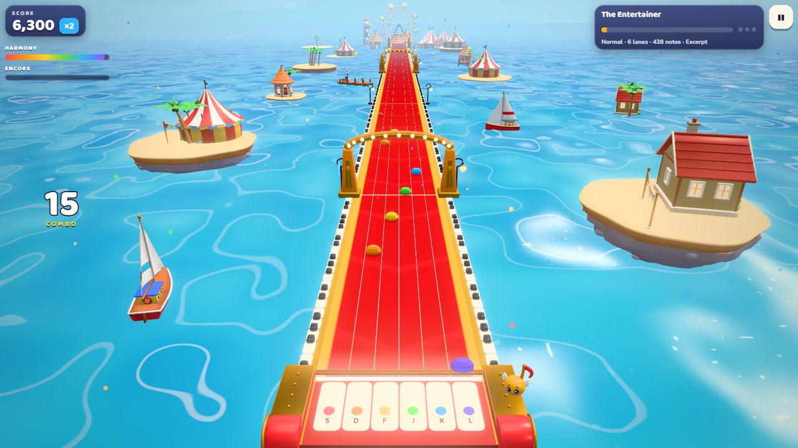

The Hush, a huge sleepy cloud, has gathered every song in the Sky Isles into
silent crystals. You captain the **Encore**, a flying grand piano, with Coda, the last
note still singing. Each song you play frees its notes, relights an island's
beacon and pours the colour back into the world.

- **43 real pieces across 9 islands:** Beethoven, Debussy, Chopin, Satie, Joplin,
  all twelve movements of Vivaldi's *Four Seasons*, Pachelbel's Canon, carols,
  anthems, folk songs and two originals.
- **Four ways to play:**
  - **👆 Tap (made for phones).** Two lanes: tap anywhere on the left or right half of
    the screen, with two thumbs. Rising notes come on the right and falling on the left.
    Hard adds both-sides-at-once taps. Timing windows are wider to absorb touch lag, and
    phones start in this mode. On a keyboard use **F/J** or the arrow keys.
  - **🎮 Lanes.** Arcade lanes follow the shape of the melody (4 lanes on Easy, 6 on
    Normal and Hard), on **D F J K** (split hands), **A S D F** (left hand) or
    **J K L ;** (right hand). The one-hand keys always use 4 lanes.
  - **🎹 Real piano.** The road becomes an actual keyboard, so every key is the true note.
    Laptop keys cover three rows (Z to /, A to ;, and the black keys above).
  - **⌨️ Words.** Each note carries a letter and the letters spell English words.
    Type them to the beat. Easy uses home-row words only (*salad*, *flask*, *glass*),
    Normal uses everyday words, and Hard uses long ones, plus words themed to each island.
    Keys and gems share touch-typing finger colours, and results show your WPM next
    to the song's own pace.
- **🎵 Keep the song playing** (on by default for Tap and Words). The whole song, melody
  included, plays by itself. Your presses are only judged, so a miss or a wrong key
  just shows on screen and the music never breaks.
- **Keyboard, touch or MIDI.** Laptop keys, phones and tablets, or a USB or
  Bluetooth MIDI keyboard (Chrome and Edge).
- **Practice mode** stops the road at every note until you play it, at 50–100% speed.
- **Rhythm-game depth:** Perfect/Great/Good timing, combo multiplier up to ×4,
  hold notes, golden phrases that charge **Encore** (double points, a golden road),
  a Harmony meter that repaints the world, stars, ranks and full-combo crowns.
  Pressing the wrong key while a note is due shows **✗ WRONG KEY** and breaks the
  combo, so mashing every lane earns no stars.
- **A living sea:** schools of toy fish swim beside the road. They leap when you hit a
  Perfect, ripple over on combo milestones, scatter when you miss and glow at night.
  They're smooth on phones too: each species is drawn in a single instanced call. Foam laps
  around every island, and gulls wheel over the sea.
- **Smooth on phones:** scenery is baked into a few draws per island, phones get light materials
  and a leaner glow, and a phone stage draws about 130 calls (it was 355). See
  [docs/PERFORMANCE.md](docs/PERFORMANCE.md).
- **Difficulty that means something:** Easy keeps to the beat, Normal plays the tune,
  and Hard adds the accompaniment wherever the melody rests.
- **Import your own MIDI or MusicXML** and it is charted automatically for every
  difficulty.

| | | |
| --- | --- | --- |
| 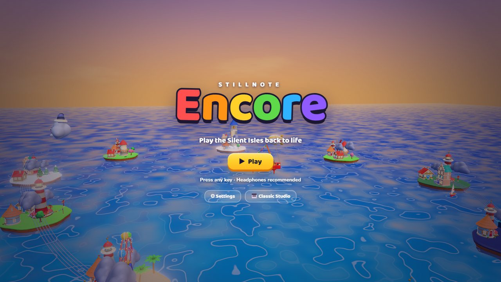 | 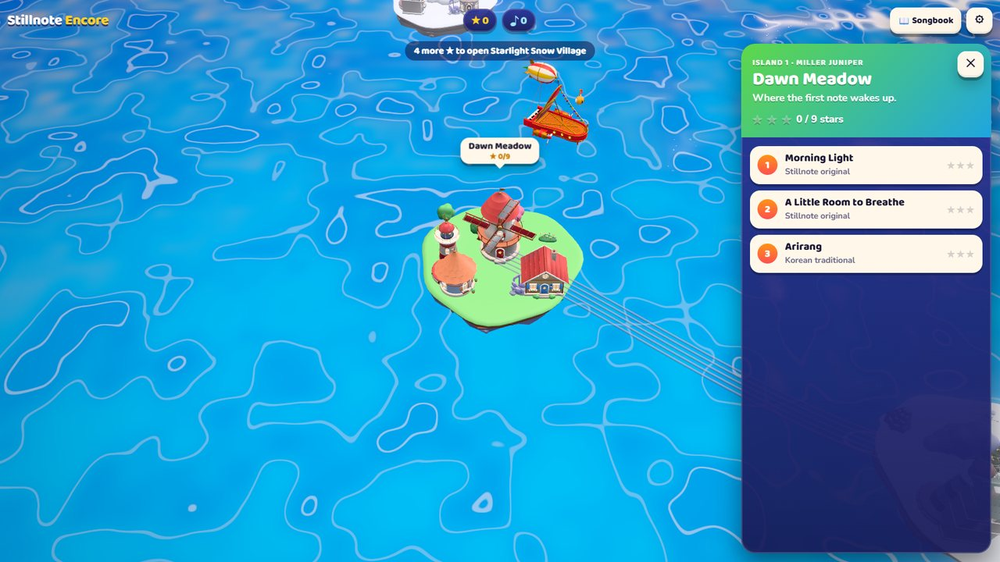 | 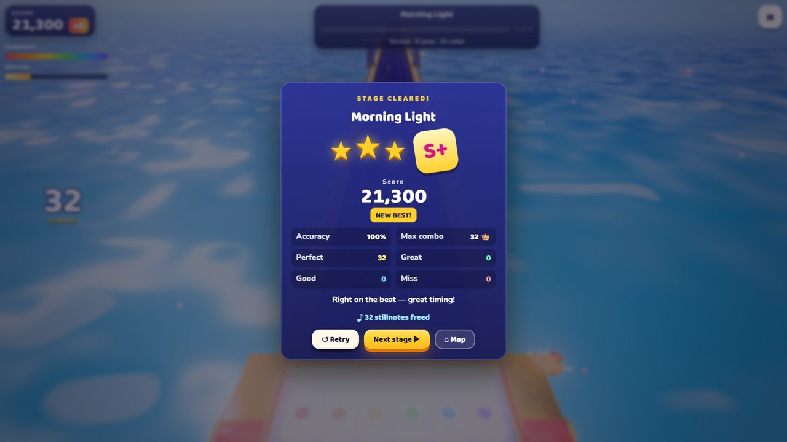 |
| 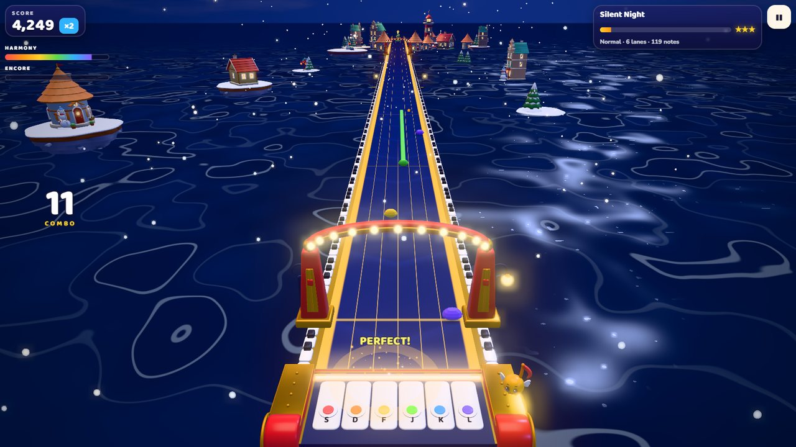 | 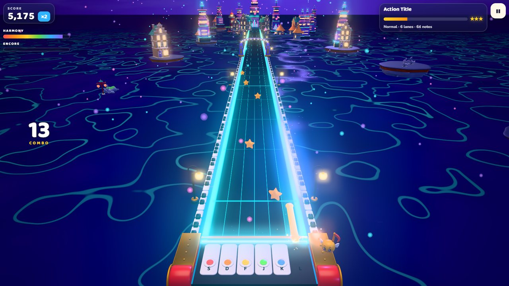 | 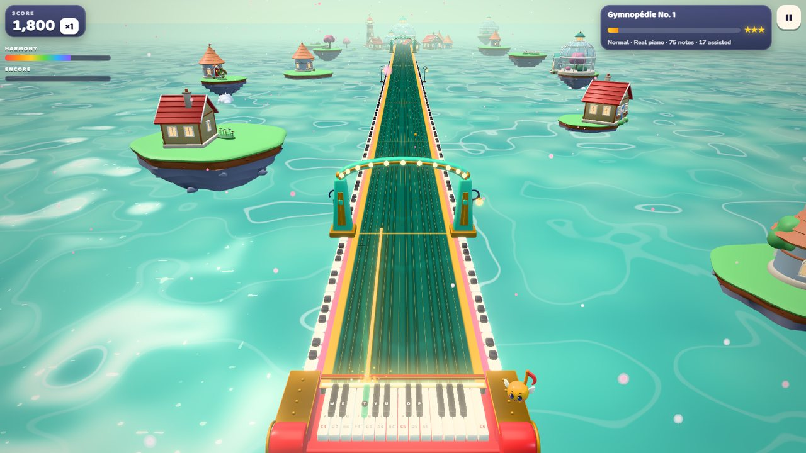 |
| 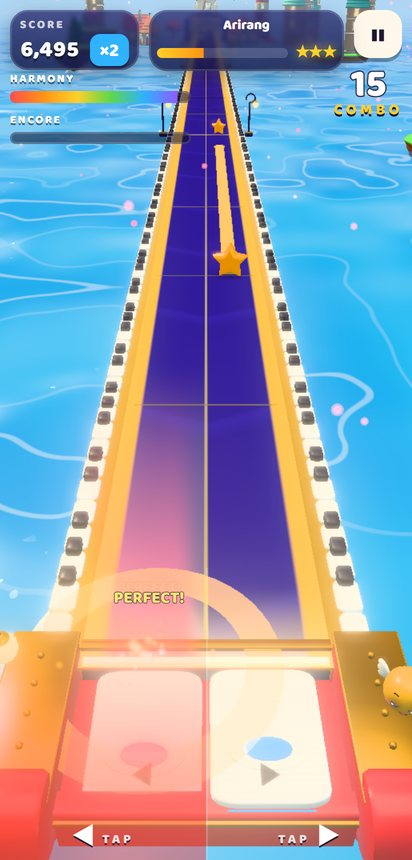 | 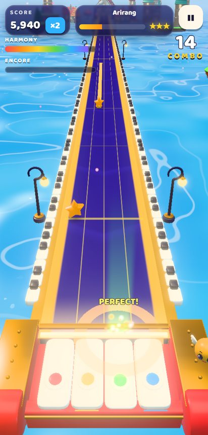 | |
| 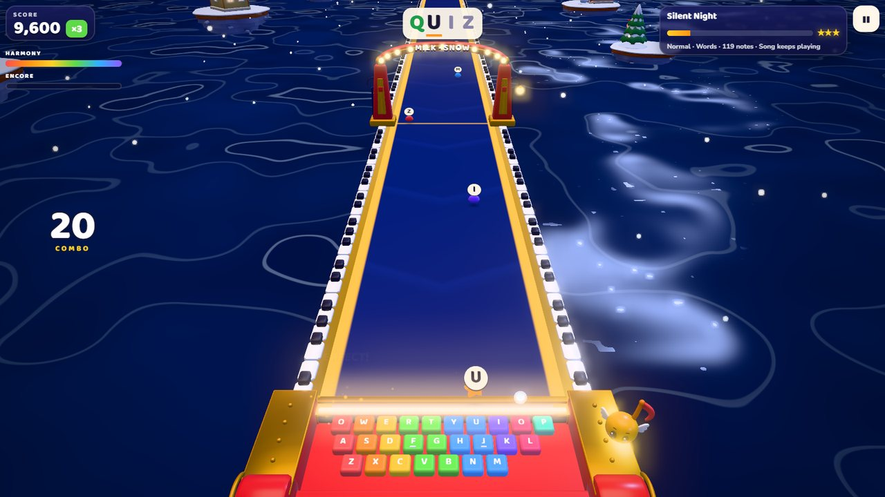 | 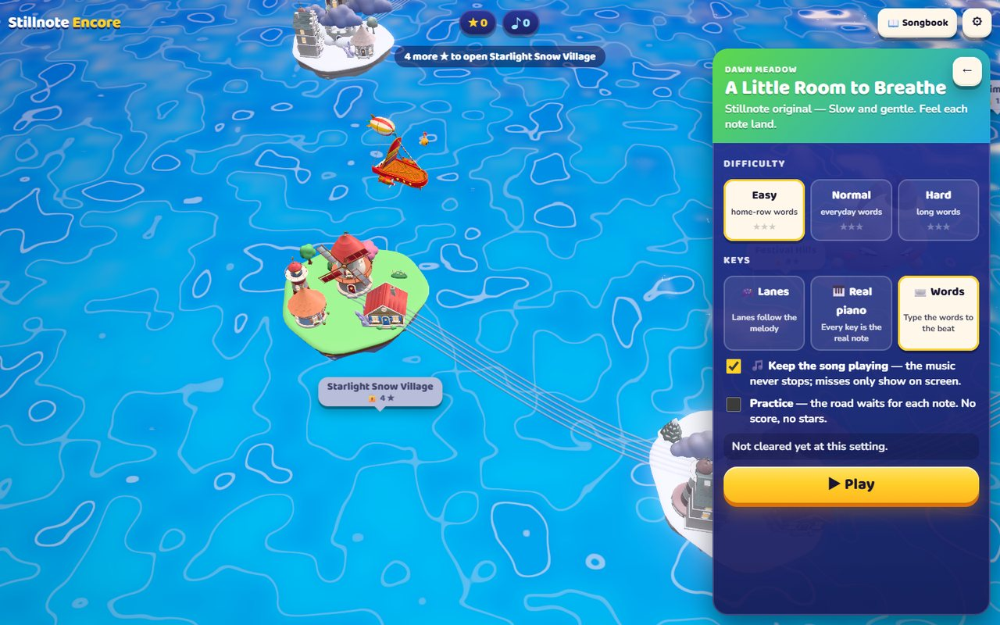 | 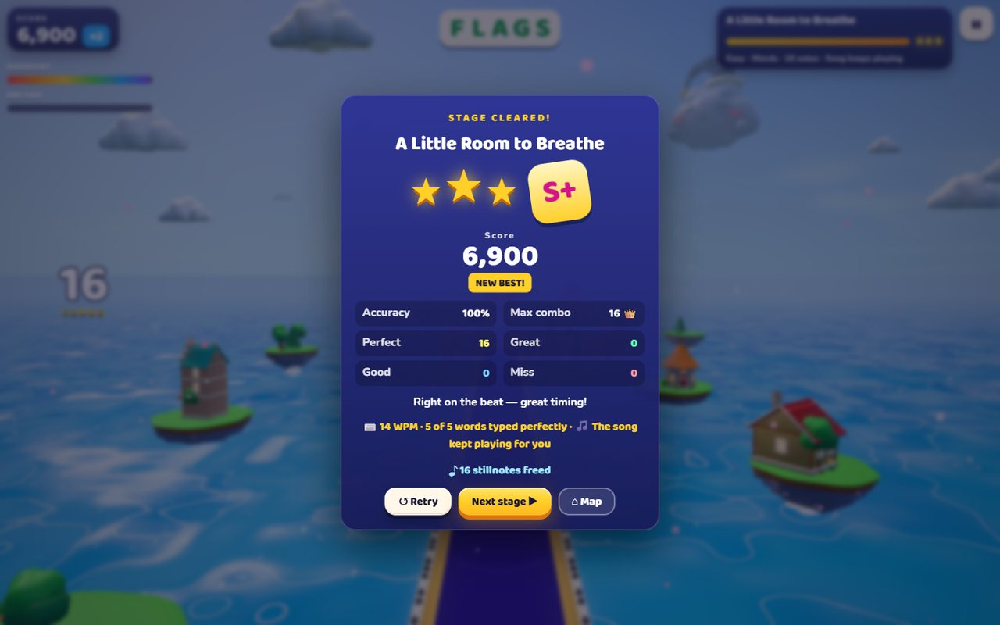 |

## How to play

| | Tap | Lanes | Real piano | Words |
| --- | --- | --- | --- | --- |
| Laptop | **F** / **J** (or **D** / **K**, **←** / **→**) | Easy **D F J K**, Normal/Hard **S D F J K L** (or the A S D F / J K L ; sets) | Chromatic **A W S E D F T G Y H U J K O L P ;** (or home row), placed for each song | Type the letter on the gem |
| Touch | Left or right half of the screen | Tap the lane | Tap the key | Tap the keycap |
| MIDI keyboard | Below / above middle C | White keys C D E F G A | Any key | — |
| Encore | **Space** or the gold button | same | same | **Enter** (Space is free for typists) |
| Pause | **Esc** / **P** / ❚❚ | same | **Esc** / ❚❚ (P may be a note) | **Esc** / ❚❚ |

Notes land on your keys at the glowing hit line. Hold a note for as long as its
ribbon lasts. Notes a lighter difficulty leaves out are played for you, so every
difficulty still sounds like the whole piece. If your speakers or Bluetooth
headphones lag, use **Settings → Calibrate timing**.

## The Sky Isles

| # | Island | Songs | Opens at |
| --- | --- | --- | --- |
| 1 | Dawn Meadow | Morning Light, A Little Room to Breathe, Arirang | start |
| 2 | Starlight Snow Village | Silent Night, O Come All Ye Faithful | 4 ★ |
| 3 | Festival Hills | Aegukga, Tiến quân ca, The Star-Spangled Banner | 8 ★ |
| 4 | Glasshouse Gardens | Für Elise, Arabesque No. 1, Gymnopédie No. 1, Prelude, Variations d'automne, Flat | 13 ★ |
| 5 | Moonlit Harbour | Moonlight Sonata I–III, Clair de lune, Nocturne Op. 9 No. 2 | 18 ★ |
| 6 | Neon Reef | A1 Listen First, Action Title | 26 ★ |
| 7 | Ragtime Pier | The Entertainer, Maple Leaf Rag | 32 ★ |
| 8 | Season Wheel | Vivaldi, The Four Seasons (12 movements) | 40 ★ |
| 9 | Carillon Crown | Canon in D (the finale) | 60 ★ |

**Settings → Open all islands** turns on free play. An island you have already played
stays open. Songs longer than about two and a half minutes play as an excerpt that ends
at a natural breath.

## Development

Node 22 or newer.

```sh
npm ci
npm run dev          # http://127.0.0.1:5173 (game) and /studio.html (classic studio)
npm test             # unit tests (charting, judging, campaign, saves, clock, input)
npm run build        # type-check + production build to dist/
npm run test:e2e     # browser suite (Playwright + real GPU; add -- --swiftshader for CI boxes)
npm run capture      # screenshots of title, map, gameplay and results in artifacts/captures
```

Pushing to `main` runs the tests, builds and deploys to GitHub Pages.

### How it's built

- **Vite + TypeScript + three.js.** `index.html` is the game (`src/game/`) and
  `studio.html` is the original studio (`src/main.ts`).
- **Pure, tested game logic.** `chart.ts` finds the melody, thins it by
  difficulty, makes holds and golden phrases, and cuts excerpts. `lanes.ts` maps the
  melody contour to lanes. `judge.ts` handles timing windows, combo, Harmony, Encore and
  results. `campaign.ts` and `save.ts` hold progression and validated local saves.
- **Audio.** `sound.ts` plays a sampled Splendid Grand plus General MIDI voices for
  ensemble accompaniment, with a synth fallback. `conductor.ts` keeps song time on the
  audio clock, compensates for output latency, looks ahead 150 ms and runs the
  practice gate.
- **Rendering.** Quality tiers, bloom with a NaN guard, neutral tone mapping, instanced
  notes, adaptive resolution and reduced-motion support. `world.ts` drains each island
  to grey with a shared "Hush" shader uniform and restores it as you play.
  `shoal-sim.ts` and `render/shoals.ts` add fish schools beside the road, one instanced
  mesh per species, bent in the vertex shader. They leap on Perfects and scatter on
  misses.
- **Art.** Every model is generated by headless Blender scripts in
  [`art/encore/`](art/encore/): the stage kit (keys, gems, arches), the world kit
  (islands, houses, landmarks), the fish kit and the characters (Coda, the Hush and the Encore). No
  image textures are used. [`CONTRACTS.md`](art/encore/CONTRACTS.md) lists the node and material
  names the game relies on. Rebuild with `node scripts/blender.mjs -b --factory-startup --python art/encore/build_stage.py`
  (and `build_world.py`, `build_characters.py`, `render_portraits.py`).

Design notes: [docs/ENCORE_DESIGN.md](docs/ENCORE_DESIGN.md). Code and logic review:
[docs/ENCORE_REVIEW.md](docs/ENCORE_REVIEW.md). Classic studio
documentation: [docs/CLASSIC_STUDIO.md](docs/CLASSIC_STUDIO.md).

## Credits and licences

- Music: public-domain and Creative Commons editions from the Mutopia Project,
  Wikimedia Commons, nationalanthems.info and OpenGameArt. Each file keeps its
  source licence; see [public/music/SOURCES.md](public/music/SOURCES.md).
- Piano: [Splendid Grand](https://github.com/sfzinstruments/SplendidGrandPiano) via
  [smplr](https://github.com/danigb/smplr) (MIT). Other instruments:
  [MusyngKite](https://github.com/gleitz/midi-js-soundfonts) (CC BY-SA 3.0). Samples
  are fetched at runtime, not redistributed.
- Libraries: three.js (MIT), @tonejs/midi (MIT), OpenSheetMusicDisplay (BSD-3, studio).
- Game design references: Rock Band 3 Pro Keys (lane vs real-key tiers), Deemo
  (songs grow the world), Hi-Fi Rush (the world on the beat), Synthesia (wait
  mode), and "Juice it or lose it" (Jonasson & Purho, GDC 2012). They served as
  inspiration only; no assets or code were copied.
- All story, characters, 3D art and the menu theme are original to Stillnote Encore.
